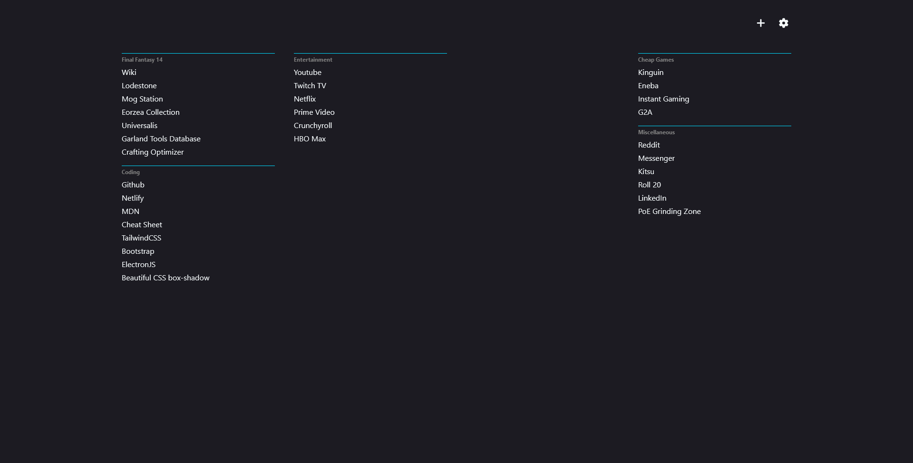
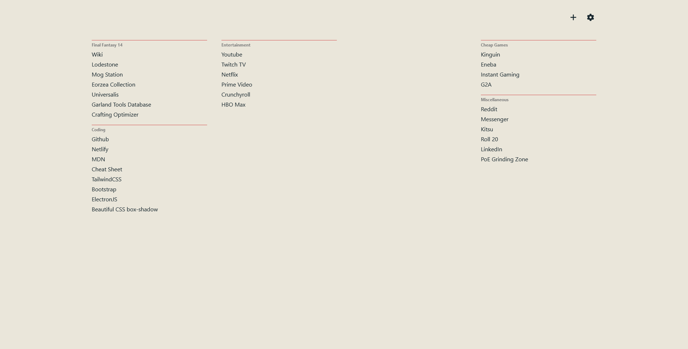
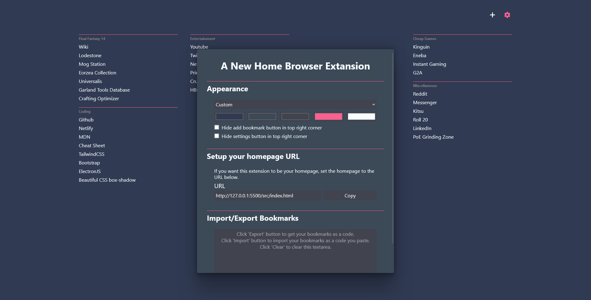
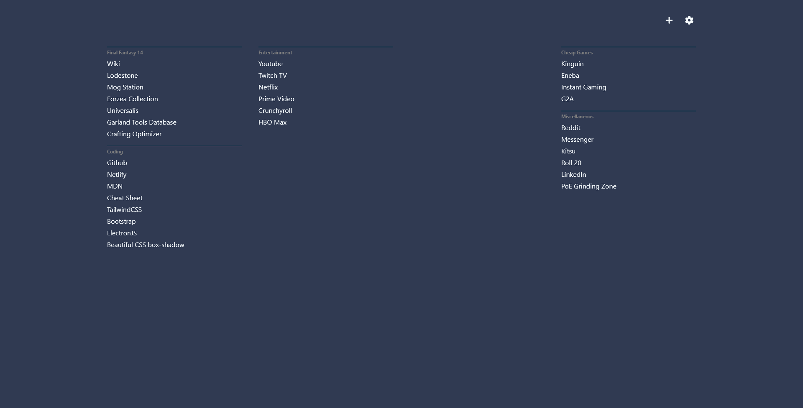
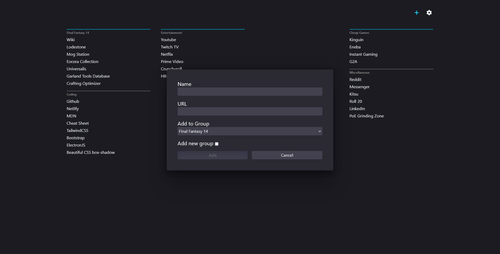
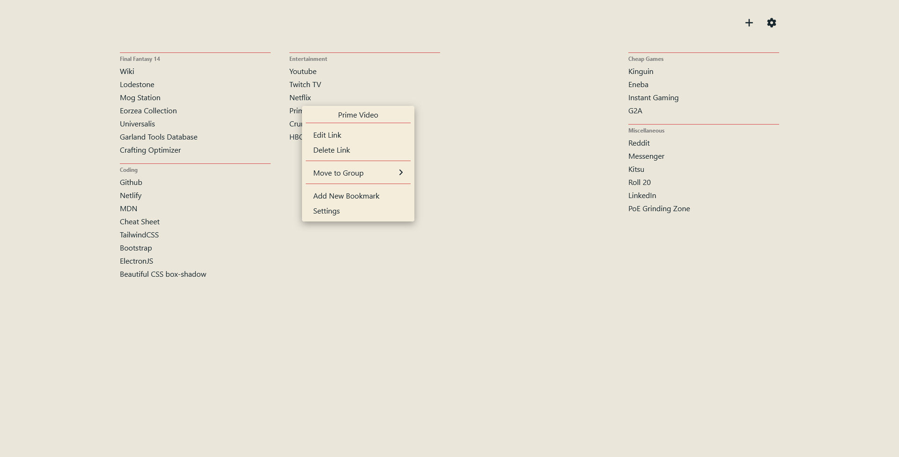

###### Browser Extansion

<h1 align="center">
 A New HOMEpage
</h1> 

 An extension for firefox and chromium that adds a homepage and a new tab page for your minimalist needs.

---

<h3 align="center">
 Get it for the browser of your choice!
  
 

  
  
  

 

</h3>

---

  

---

  
  
  
  
  

---
